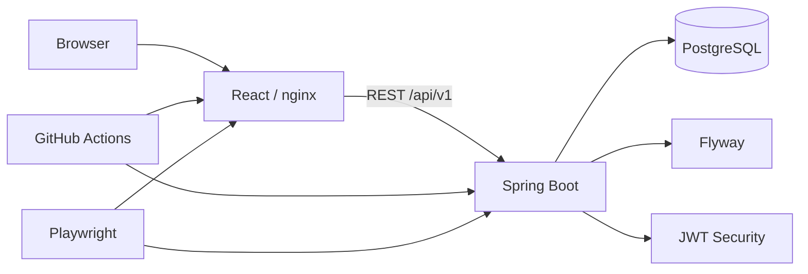

# Kolaysoft CTO Dashboard

Haftalık proje durum raporlama ve CTO portföy izleme sistemi  
Kolaysoft Yaz Stajı 2026 — Full Stack MVP

---

## Proje Özeti

Kolaysoft’ta farklı proje yöneticileri tarafından yürütülen projelerin **haftalık durum bilgileri** merkezi biçimde toplanır; **CTO** tüm proje portföyünü tek dashboard üzerinden izler.

İş değeri:

- Dağınık haftalık raporlamayı standartlaştırma
- Proje yöneticisinin kendi projesini raporlaması (ilerleme, iş kalemi, risk)
- CTO’nun hedef/gerçekleşen ilerleme, sağlık ve risk görünürlüğü
- Admin’in kullanıcı, proje ve ekip ataması yönetimi

---

## Problem ve Amaç

**Problem:** Proje durumu e-posta / dosya / bireysel formatlarda dağılır; CTO tek bakışta portföy sağlığını göremez.

**Amaç:** JWT güvenliği, rol bazlı yetki, haftalık rapor + risk + iş kalemi ve CTO dashboard ile yönetilebilir bir MVP sunmak.

---

## Hedef Kullanıcılar ve Roller

| Rol | Yetki özeti |
|-----|-------------|
| **ADMIN** | Kullanıcı CRUD, proje oluşturma/düzenleme, ana yönetici + ekip ataması |
| **PROJECT_MANAGER** | Atandığı projeler; haftalık rapor, work item, risk yazma |
| **CTO** | Tüm portföy, dashboard, proje detay, rapor/risk/WI **salt okuma** |

**Not:** UI’da gizlenen butonlar tek güvenlik katmanı değildir; yetki **backend**’de de uygulanır. UI visibility + API authorization birlikte çalışır.

---

## Temel Özellikler

- JWT authentication, role-based authorization
- Kullanıcı / proje yönetimi, project assignment (ekip)
- Haftalık rapor, work item, risk/issue
- CTO dashboard (KPI, sağlık dağılımı, filtreli portföy)
- Project Detail Command Center (sekmeler)
- Deterministik **Executive Project Insight** ve **Portfolio Attention Center** (UI-only; AI yok)
- Loading / empty / error state’ler, responsive enterprise UI
- Flyway migration (`ddl-auto=validate`)
- Backend automated tests, Playwright E2E, GitHub Actions CI
- Docker Compose yerel Full Stack ortamı

---

## Sistem Mimarisi

```text
Browser
   │
   ├─ Local dev: Vite :5173  ──HTTP──►  Spring Boot :8080  ──►  PostgreSQL
   │
   └─ Docker:    nginx :3000
                    ├─ /          → static SPA
                    └─ /api/...   → proxy → backend:8080  →  postgres
```



Yan bileşenler: Flyway, JWT, Playwright, GitHub Actions, Docker Compose.

---

## Teknolojiler

Kaynak: `pom.xml`, `package.json`

| Katman | Teknoloji |
|--------|-----------|
| Backend | Java **21**, Spring Boot **3.5.16**, Spring Security, Spring Data JPA, Flyway, PostgreSQL, Maven Wrapper, springdoc OpenAPI **2.8.17**, JJWT **0.12.6** |
| Frontend | React **18.3**, TypeScript **5.8**, Vite **6.3**, MUI **7**, TanStack Query **5**, Axios, React Router **6**, React Hook Form, Zod |
| Quality | JUnit / Spring Boot Test, Playwright **1.55**, ESLint, GitHub Actions, Docker / Compose |

---

## Proje Yapısı

```text
Kolaysoft-CTO-Dashboard/
├── backend/cto-dashboard-api/     # Spring Boot API
├── frontend/                      # React (Vite)
├── docs/                          # Analiz, test, deployment
├── database/                      # Referans SQL (şema Flyway’de)
├── docker-compose.yml
├── .env.docker.example
└── .github/workflows/ci.yml
```

---

## Hızlı Başlangıç — Docker Compose

**DEVELOPMENT / DEMO ONLY** — production secret değildir.

```bash
docker compose --env-file .env.docker.example up --build
```

| Servis | URL |
|--------|-----|
| Uygulama | http://localhost:3000 |
| API | http://localhost:8080 |
| Health | http://localhost:8080/api/v1/health |
| Swagger | http://localhost:8080/swagger-ui/index.html |

**Demo ADMIN (dev seed):** `admin@kolaysoft.com.tr` / `Admin123!`

### Servis başlatma sırası (Compose)

1. **PostgreSQL** (health: `pg_isready`)
2. **Flyway** migration (backend startup)
3. **Spring Boot** (`dev` profil + seed)
4. **nginx frontend** (backend healthy sonrası)
5. Browser → `:3000` (API same-origin `/api/v1`)

```bash
docker compose down          # volume korunur
docker compose down -v       # DİKKAT: DB volume SİLİNİR
```

Ayrıntı: [`docs/deployment/Docker_Compose_Local_Setup.md`](docs/deployment/Docker_Compose_Local_Setup.md)

---

## Manuel Kurulum

### Gereksinimler

- Java 21, Node 20+, npm, PostgreSQL 16 (veya Docker ile yalnız DB)

### PostgreSQL

```powershell
docker run -d --name cto-dashboard-postgres `
  -e POSTGRES_DB=cto_dashboard `
  -e POSTGRES_USER=postgres `
  -e POSTGRES_PASSWORD=postgres `
  -p 5432:5432 postgres:16-alpine
```

### Backend

```powershell
cd backend/cto-dashboard-api
$env:SPRING_PROFILES_ACTIVE="dev"
$env:DB_URL="jdbc:postgresql://localhost:5432/cto_dashboard"
$env:DB_USERNAME="postgres"
$env:DB_PASSWORD="postgres"
./mvnw.cmd spring-boot:run
```

(Linux/macOS: `./mvnw spring-boot:run`)

### Frontend

```powershell
cd frontend
copy .env.example .env
npm ci
npm run dev
```

Uygulama: http://localhost:5173

---

## Environment Variables

Gerçek `.env` / `.env.docker` / `.env.e2e` **commit edilmez**.

| Variable | Used by | Purpose | Example | Required |
|----------|---------|---------|---------|----------|
| `DB_URL` | Backend | JDBC URL | `jdbc:postgresql://localhost:5432/cto_dashboard` | Prod: evet; Dev: default var |
| `DB_USERNAME` | Backend | DB user | `postgres` | Aynı |
| `DB_PASSWORD` | Backend | DB password | *(local only)* | Aynı |
| `SPRING_PROFILES_ACTIVE` | Backend | Profil | `dev` / `prod` | Hayır (default `dev`) |
| `JWT_SECRET` | Backend | JWT imza | uzun rastgele string | Prod: evet; Dev: fallback |
| `JWT_EXPIRATION_MS` | Backend | Token süresi | `3600000` | Hayır |
| `SERVER_PORT` | Backend | HTTP port | `8080` | Hayır |
| `VITE_API_BASE_URL` | Frontend build | API base | `http://localhost:8080/api/v1` veya `/api/v1` | Hayır (default localhost) |
| `E2E_ADMIN_EMAIL` | Playwright | Admin e-posta | `admin@kolaysoft.com.tr` | E2E |
| `E2E_ADMIN_PASSWORD` | Playwright | Admin şifre | *(env)* | E2E |
| `E2E_BASE_URL` | Playwright | FE URL | `http://localhost:5173` | Hayır |

Örnek dosyalar:

- [`.env.docker.example`](.env.docker.example)
- [`frontend/.env.example`](frontend/.env.example)
- [`frontend/.env.e2e.example`](frontend/.env.e2e.example)

---

## Database & Flyway

- Şema: `classpath:db/migration` → `V1__init_schema.sql`
- Hibernate: `ddl-auto=validate` (otomatik şema üretmez)
- Clean DB: Flyway V1 + `flyway_schema_history` + `DevDataInitializer` (yalnız `dev`)
- Docker Compose volume: `postgres_data` (`down` korur, `down -v` siler)
- **Compose/clean DB’de baseline gerekmez**

Legacy DB (`ddl-auto=update` ile oluşmuş, history yok) için baseline: [`docs/analysis/Day14_Flyway_Migration_Setup.md`](docs/analysis/Day14_Flyway_Migration_Setup.md)

---

## CORS / API URL

### Local Vite (`:5173`)

- Origin allowlist: `http://localhost:5173` (`CorsConfig`)
- `VITE_API_BASE_URL=http://localhost:8080/api/v1`

### Docker (`:3000`)

- Browser **container hostname `backend` kullanmaz** (yalnız Docker network içi).
- SPA `VITE_API_BASE_URL=/api/v1` (same-origin) → nginx `/api` → `backend:8080`
- Bu yolda ekstra CORS gerekmez.

---

## Demo Kullanıcıları

| Rol | Nasıl | Credential |
|-----|--------|------------|
| **ADMIN** | `DevDataInitializer` (`dev`) | `admin@kolaysoft.com.tr` / `Admin123!` — **DEMO ONLY** |
| **CTO** | Seed yok | ADMIN → Kullanıcılar veya API `POST /users` |
| **PROJECT_MANAGER** | Seed yok | Aynı |

---

## API / Swagger

- Swagger UI: http://localhost:8080/swagger-ui/index.html
- Health: http://localhost:8080/api/v1/health

Kaynak grupları (katalog Swagger’da): auth, users, projects, project assignments, weekly reports, work items, risks, dashboard.

---

## Testler

### Backend Tests

```powershell
cd backend/cto-dashboard-api
./mvnw.cmd test
./mvnw.cmd clean package
```

Doğrulanmış suite: **79/79 PASS** (Day 17+ regression).

### Frontend Quality

```powershell
cd frontend
npm run lint
npm run build
```

### Playwright E2E

```powershell
# Postgres + backend ayakta
cd frontend
copy .env.e2e.example .env.e2e
# E2E_ADMIN_PASSWORD doldurun (seed ile uyumlu)
npm run test:e2e
```

Kapsam (**7** senaryo): Auth · ADMIN (kullanıcı/proje/ekip) · PM (rapor) · CTO (dashboard/insight, read-only).

[`docs/testing/Automated_E2E_Test_Strategy.md`](docs/testing/Automated_E2E_Test_Strategy.md)

### CI Quality Gate

[`.github/workflows/ci.yml`](.github/workflows/ci.yml) — `push` / `PR` → `main`:

1. Backend Quality  
2. Frontend Quality  
3. Full Stack E2E (temiz Postgres + Flyway + Playwright)

Failure artifact: Playwright report/trace + `backend-ci.log`  
[`docs/testing/CI_Quality_Gate.md`](docs/testing/CI_Quality_Gate.md)

---

## Uçtan Uca Demo Senaryosu

Adım adım (ADMIN → PM → CTO):  
[`docs/demo/Day18_End_to_End_Demo_Scenario.md`](docs/demo/Day18_End_to_End_Demo_Scenario.md)

---

## Bilinen Eksikler / Sınırlamalar

**Bug (MVP):** 0 (Day 16 kritik bug’lar kapatıldı; regression yeşil)

**Known limitations**

- Production deployment / monitoring / audit log yok
- Server-side JWT `exp` bekleme E2E’si yok (client `expiresAt` + invalid token test edilir)
- Attention Center mevcut dashboard portföy sayfası/filtre bağlamıyla sınırlı
- PM proje listesi backend’de ayrı endpoint yok; FE rapor + id cache kullanır
- E2E destructive cleanup yok (unique timestamp veri)
- Frontend unit test (Vitest/RTL) yok
- Refresh token endpointi yok

**Future improvements:** production secrets yönetimi, gözlemlenebilirlik, PM list API, E2E cleanup, FE unit testleri.

---

## Troubleshooting

| Sorun | Çözüm |
|-------|--------|
| `5432` dolu | Eski `cto-dashboard-postgres` veya Compose çakışması; birini durdurun |
| Docker Desktop kapalı | Docker’ı başlatın |
| Java sürümü | `java -version` → 21 |
| Backend health fail | DB env, Flyway log, JWT |
| CORS (Vite) | Origin `localhost:5173`; CI’da `127.0.0.1` kullanmayın |
| Eski Docker volume | Bilinçli: `docker compose down -v` — **DB verisi silinir** |
| Legacy DB + Flyway conflict | Baseline (yukarıdaki Flyway dokümanı) |

---

## Teknik Dokümanlar

| Konu | Doküman |
|------|---------|
| Day 18 teslim | [`docs/analysis/Day18_README_and_Delivery_Documentation.md`](docs/analysis/Day18_README_and_Delivery_Documentation.md) |
| Teknik kararlar | [`docs/architecture/Technical_Decisions.md`](docs/architecture/Technical_Decisions.md) |
| Docker Compose | [`docs/deployment/Docker_Compose_Local_Setup.md`](docs/deployment/Docker_Compose_Local_Setup.md) |
| Flyway | [`docs/analysis/Day14_Flyway_Migration_Setup.md`](docs/analysis/Day14_Flyway_Migration_Setup.md) |
| E2E | [`docs/testing/Automated_E2E_Test_Strategy.md`](docs/testing/Automated_E2E_Test_Strategy.md) |
| CI | [`docs/testing/CI_Quality_Gate.md`](docs/testing/CI_Quality_Gate.md) |
| Day 15 MVP test | [`docs/testing/Day15_MVP_Test_Report.md`](docs/testing/Day15_MVP_Test_Report.md) |
| Day 16 bug fix | [`docs/testing/Day16_Bug_Fix_and_Retest_Report.md`](docs/testing/Day16_Bug_Fix_and_Retest_Report.md) |
| Day 17 regression | [`docs/testing/Day17_Full_Stack_MVP_Regression_Report.md`](docs/testing/Day17_Full_Stack_MVP_Regression_Report.md) |
| Day 17 assignment | [`docs/analysis/Day17_Admin_Project_Assignment_Gaps_Completion.md`](docs/analysis/Day17_Admin_Project_Assignment_Gaps_Completion.md) |
| Demo senaryosu | [`docs/demo/Day18_End_to_End_Demo_Scenario.md`](docs/demo/Day18_End_to_End_Demo_Scenario.md) |
| Analiz (Day 6–15) | [`docs/analysis/`](docs/analysis/) |

---

## Git / Commit Yaklaşımı

- Anlamlı, küçük commit’ler; secret / `.env` commit edilmez
- Örnek önekler: `feat:`, `fix:`, `test:`, `ci:`, `build:`, `docs:`
- `main` koruması için CI job’ları required check olabilir (manuel branch protection)
