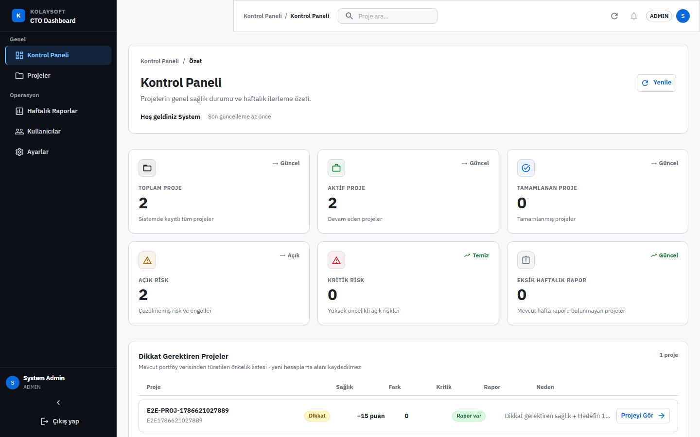
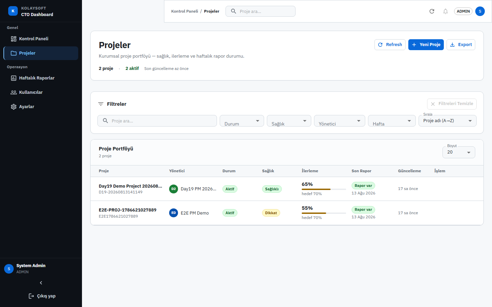
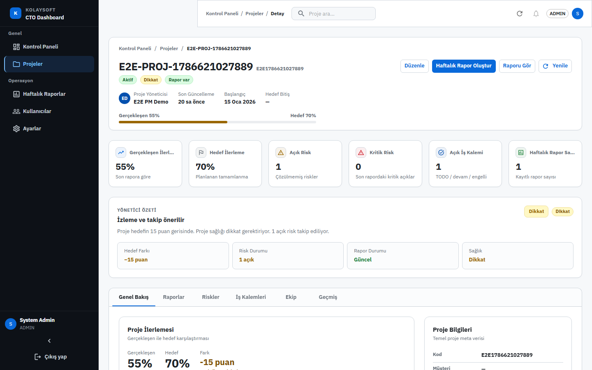
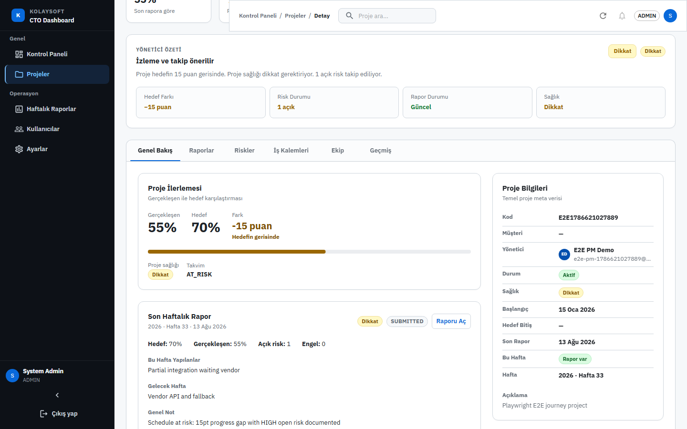
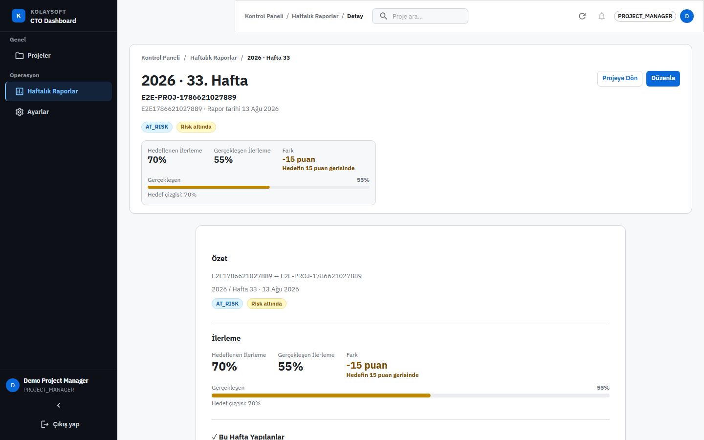
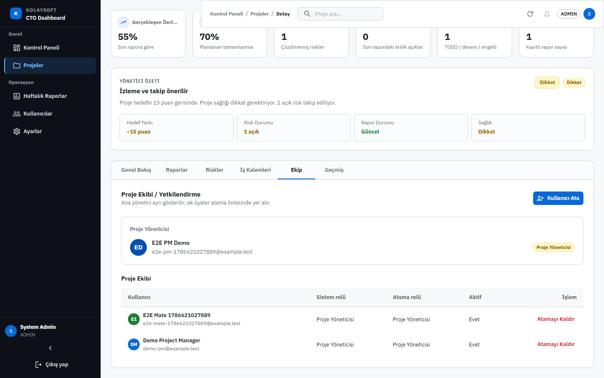
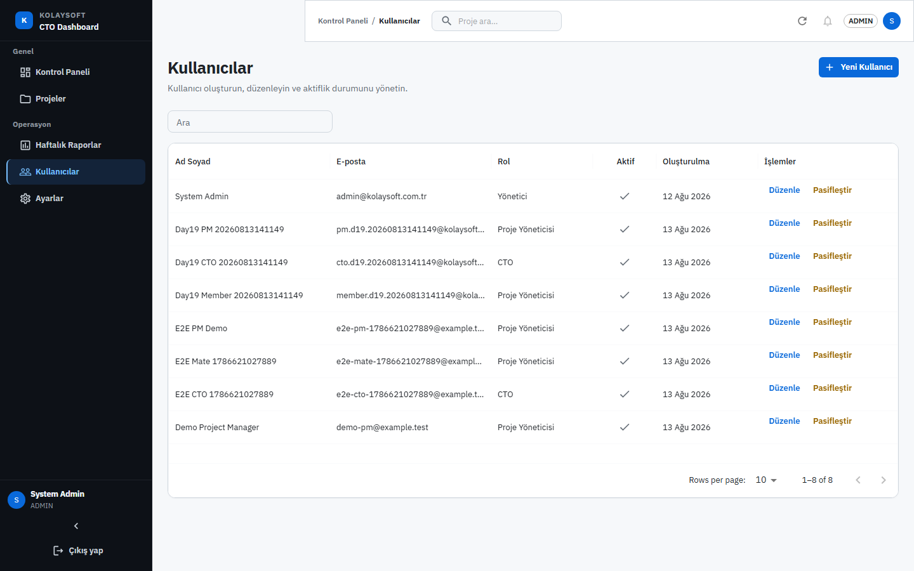
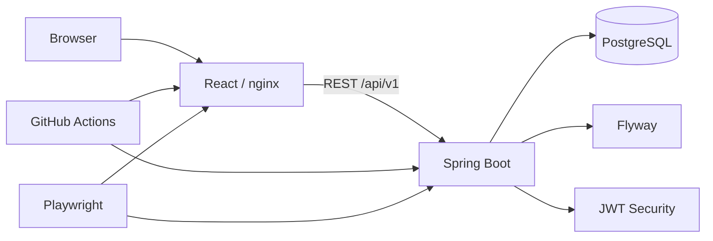

# Kolaysoft CTO Dashboard

**Proje yöneticilerinin haftalık ilerlemeyi raporladığı, CTO'nun tüm proje portföyünü sağlık, risk ve hedef/gerçekleşen ilerleme açısından izlediği rol bazlı Full Stack yönetim sistemi.**

Role-based weekly project reporting and executive portfolio monitoring platform.

Dağınık haftalık raporlamayı merkezi, izlenebilir ve karşılaştırılabilir bir proje yönetim akışına dönüştürür.

[Ürün Turu](#ürün-turu) · [Özellikler](#temel-özellikler) · [Mimari](#sistem-mimarisi) · [Kurulum](#hızlı-başlangıç--docker-compose) · [API](#api--swagger) · [Testler](#testler) · [Demo](#uçtan-uca-demo-senaryosu) · [Dokümantasyon](#teknik-dokümanlar)

[](https://github.com/feyzasagman/kolaysoft-cto-dashboard/actions/workflows/ci.yml)


Kolaysoft CTO Dashboard; ADMIN, PROJECT_MANAGER ve CTO rollerini tek akışta birleştirir. Proje yöneticileri haftalık rapor, work item ve risk verilerini yönetirken CTO, dashboard ve Project Detail üzerinden portföy sağlığını izler. Sistem; JWT/RBAC, Flyway, Playwright E2E, GitHub Actions CI ve Docker Compose ile doğrulanmış bir Full Stack MVP’dir.

---

## İçindekiler Tablosu

### Ürün

- [Bu Proje Neyi Gösteriyor?](#bu-proje-neyi-gösteriyor)
- [Quality Snapshot](#quality-snapshot)
- [Demo Flow](#demo-flow)
- [Ürün Turu](#ürün-turu)
- [Proje Özeti](#proje-özeti)
- [Problem ve Amaç](#problem-ve-amaç)
- [Hedef Kullanıcılar ve Roller](#hedef-kullanıcılar-ve-roller)
- [Temel Özellikler](#temel-özellikler)

### Teknik

- [Sistem Mimarisi](#sistem-mimarisi)
- [Teknolojiler](#teknolojiler)
- [Proje Yapısı](#proje-yapısı)
- [Repository Guide](#repository-guide)
- [Environment Variables](#environment-variables)
- [Database & Flyway](#database--flyway)
- [CORS / API URL](#cors--api-url)

### Kurulum ve Çalıştırma

- [Hızlı Başlangıç — Docker Compose](#hızlı-başlangıç--docker-compose)
- [Manuel Kurulum](#manuel-kurulum)
- [Demo Kullanıcıları](#demo-kullanıcıları)
- [API / Swagger](#api--swagger)

### Kalite ve Test

- [Testler](#testler)
- [CI Quality Gate](#ci-quality-gate)
- [Uçtan Uca Demo Senaryosu](#uçtan-uca-demo-senaryosu)
- [Bilinen Eksikler / Sınırlamalar](#bilinen-eksikler--sınırlamalar)
- [Troubleshooting](#troubleshooting)

### Dokümantasyon

- [Teknik Dokümanlar](#teknik-dokümanlar)
- [Git / Commit Yaklaşımı](#git--commit-yaklaşımı)

---

## Bu Proje Neyi Gösteriyor?

- Role-based Full Stack architecture
- ADMIN → PROJECT_MANAGER → CTO workflow
- Automated backend regression tests
- Playwright end-to-end testing
- GitHub Actions quality gate
- Dockerized reproducible local environment

## Quality Snapshot

| Metrik | Sonuç |
| --- | --- |
| Backend tests | **79/79 PASS** |
| Playwright E2E | **7/7 PASS** |
| CI Quality Gate | **PASS** |
| Docker Demo | **VERIFIED** |
| Known open MVP bugs | **0** |
| Functional gaps (MVP kritik) | **0** |

> Verified Local Docker Demo — cloud production deployment değildir.

## Demo Flow

```text
ADMIN
  → Kullanıcı
  → Proje
  → Assignment

PROJECT_MANAGER
  → Weekly Report
  → Work Item
  → Risk

CTO
  → Dashboard
  → Attention Center
  → Executive Insight
```

Adım adım senaryo: [`docs/demo/Day18_End_to_End_Demo_Scenario.md`](docs/demo/Day18_End_to_End_Demo_Scenario.md)

---

## Ürün Turu

Gerçek Docker demo ortamından (`http://localhost:3000`) yakalanmış uygulama ekranları. Yeniden üretmek için: `frontend` içinde `npm run capture:screenshots` — ayrıntılar: [`docs/demo/Product_Tour_Screenshot_Guide.md`](docs/demo/Product_Tour_Screenshot_Guide.md).

### CTO Dashboard



Portföy KPI’ları, proje sağlığı, dikkat gerektiren projeler ve özet görünüm.

### Project Portfolio



Filtreler, sağlık/durum, yönetici, ilerleme ve son rapor bilgisiyle proje listesi.

### Project Command Center



YELLOW proje detayı: hero, metrikler, sekmeler ve genel bakış.



Yönetici Özeti — hedef/gerçekleşen fark, sağlık, risk ve rapor durumu.

### Weekly Reporting



PROJECT_MANAGER görünümü: hafta, ilerleme, takvim/risk durumu ve rapor içeriği.

### Team & User Management



Proje detayında ekip sekmesi — proje yöneticisi, atamalar ve yetkilendirme.



ADMIN kullanıcı listesi — roller, aktiflik ve yeni kullanıcı oluşturma.

---

## Proje Özeti

Kolaysoft’ta farklı proje yöneticileri tarafından yürütülen projelerin **haftalık durum bilgileri** merkezi biçimde toplanır; **CTO** tüm proje portföyünü tek dashboard üzerinden izler.

İş değeri:

- Dağınık haftalık raporlamayı standartlaştırma
- Proje yöneticisinin kendi projesini raporlaması (ilerleme, iş kalemi, risk)
- CTO’nun hedef/gerçekleşen ilerleme, sağlık ve risk görünürlüğü
- Admin’in kullanıcı, proje ve ekip ataması yönetimi

---

## Problem ve Amaç

**Problem:** Proje durumu e-posta / dosya / bireysel formatlarda dağılır; CTO tek bakışta portföy sağlığını göremez.

**Amaç:** JWT güvenliği, rol bazlı yetki, haftalık rapor + risk + iş kalemi ve CTO dashboard ile yönetilebilir bir MVP sunmak.

---

## Hedef Kullanıcılar ve Roller

| Rol | Yetki Özeti |
| --- | --- |
| **ADMIN** | Kullanıcı CRUD, proje oluşturma/düzenleme, ana yönetici + ekip ataması |
| **PROJECT_MANAGER** | Atandığı projeler; haftalık rapor, work item, risk yazma |
| **CTO** | Tüm portföy, dashboard, proje detay, rapor/risk/WI **salt okuma** |

**Not:** UI’da gizlenen butonlar tek güvenlik katmanı değildir; yetki **backend**’de de uygulanır. UI visibility + API authorization birlikte çalışır.

---

## Temel Özellikler

- JWT authentication, role-based authorization
- Kullanıcı / proje yönetimi, project assignment (ekip)
- Haftalık rapor, work item, risk/issue
- CTO dashboard (KPI, sağlık dağılımı, filtreli portföy)
- Project Detail Command Center (sekmeler)
- Deterministik **Executive Project Insight** ve **Portfolio Attention Center** (UI-only; AI yok)
- Loading / empty / error state’ler, responsive enterprise UI
- Flyway migration (`ddl-auto=validate`)
- Backend automated tests, Playwright E2E, GitHub Actions CI
- Docker Compose yerel Full Stack ortamı

---

## Sistem Mimarisi

```text
Browser
   │
   ├─ Local dev: Vite :5173  ──HTTP──►  Spring Boot :8080  ──►  PostgreSQL
   │
   └─ Docker:    nginx :3000
                    ├─ /          → static SPA
                    └─ /api/...   → proxy → backend:8080  →  postgres
```



Yan bileşenler: Flyway, JWT, Playwright, GitHub Actions, Docker Compose.

---

## Teknolojiler

Kaynak: `pom.xml`, `package-lock.json`

| Katman | Teknoloji |
| --- | --- |
| Backend | Java **21**, Spring Boot **3.5.16**, Spring Security, Spring Data JPA, Flyway, PostgreSQL, Maven Wrapper, springdoc OpenAPI **2.8.17**, JJWT **0.12.6** |
| Frontend | React **18.3.1**, TypeScript **5.8.3**, Vite **6.4.3**, MUI **7.3.11**, TanStack Query **5.101.4**, Axios, React Router **6**, React Hook Form, Zod |
| Quality | JUnit / Spring Boot Test, Playwright **1.55.0**, ESLint, GitHub Actions, Docker / Compose |

---

## Proje Yapısı

```text
Kolaysoft-CTO-Dashboard/
├── backend/cto-dashboard-api/     # Spring Boot REST API
├── frontend/                      # React UI + Playwright E2E
├── docs/                          # Analysis, testing, deployment, demo
├── database/                      # Referans SQL (şema Flyway’de)
├── docker-compose.yml             # Local Full Stack
├── .env.docker.example            # DEMO/LOCAL env örneği
└── .github/workflows/ci.yml       # CI Quality Gate
```

## Repository Guide

| Path | İçerik |
| --- | --- |
| `backend/` | Spring Boot API |
| `frontend/` | React UI + Playwright |
| `docs/analysis/` | Day/task analysis |
| `docs/testing/` | Regression / E2E / CI |
| `docs/deployment/` | Docker & local demo |
| `docs/architecture/` | Technical decisions |
| `docs/demo/` | Demo scenarios |

---

## Hızlı Başlangıç — Docker Compose

**DEVELOPMENT / DEMO ONLY** — production secret değildir.

```bash
docker compose --env-file .env.docker.example up --build
```

| Servis | URL |
| --- | --- |
| Uygulama | http://localhost:3000 |
| API | http://localhost:8080 |
| Health | http://localhost:8080/api/v1/health |
| Swagger | http://localhost:8080/swagger-ui/index.html |

**Demo ADMIN (dev seed):** `admin@kolaysoft.com.tr` / `Admin123!`

Production ortamlarında varsayılan kullanıcı/parola kullanılmamalı; kimlik bilgileri secret/env yönetimi üzerinden sağlanmalıdır.

### Servis başlatma sırası (Compose)

1. **PostgreSQL** (health: `pg_isready`)
2. **Flyway** migration (backend startup)
3. **Spring Boot** (`dev` profil + seed)
4. **nginx frontend** (backend healthy sonrası)
5. Browser → `:3000` (API same-origin `/api/v1`)

```bash
docker compose down          # volume korunur
docker compose down -v       # DİKKAT: DB volume SİLİNİR
```

Ayrıntı: [`docs/deployment/Docker_Compose_Local_Setup.md`](docs/deployment/Docker_Compose_Local_Setup.md)

---

## Manuel Kurulum

### Gereksinimler

- Java 21, Node 20+, npm, PostgreSQL 16 (veya Docker ile yalnız DB)

### PostgreSQL

```powershell
docker run -d --name cto-dashboard-postgres `
  -e POSTGRES_DB=cto_dashboard `
  -e POSTGRES_USER=postgres `
  -e POSTGRES_PASSWORD=postgres `
  -p 5432:5432 postgres:16-alpine
```

### Backend

```powershell
cd backend/cto-dashboard-api
$env:SPRING_PROFILES_ACTIVE="dev"
$env:DB_URL="jdbc:postgresql://localhost:5432/cto_dashboard"
$env:DB_USERNAME="postgres"
$env:DB_PASSWORD="postgres"
./mvnw.cmd spring-boot:run
```

(Linux/macOS: `./mvnw spring-boot:run`)

### Frontend

```powershell
cd frontend
copy .env.example .env
npm ci
npm run dev
```

Uygulama: http://localhost:5173

---

## Environment Variables

Gerçek `.env` / `.env.docker` / `.env.e2e` **commit edilmez**.

| Variable | Used By | Purpose | Example | Required |
| --- | --- | --- | --- | --- |
| `DB_URL` | Backend | JDBC URL | `jdbc:postgresql://localhost:5432/cto_dashboard` | Prod: evet; Dev: default var |
| `DB_USERNAME` | Backend | DB user | `postgres` | Aynı |
| `DB_PASSWORD` | Backend | DB password | *(local only)* | Aynı |
| `SPRING_PROFILES_ACTIVE` | Backend | Profil | `dev` / `prod` | Hayır (default `dev`) |
| `JWT_SECRET` | Backend | JWT imza | uzun rastgele string | Prod: evet; Dev: fallback |
| `JWT_EXPIRATION_MS` | Backend | Token süresi | `3600000` | Hayır |
| `SERVER_PORT` | Backend | HTTP port | `8080` | Hayır |
| `VITE_API_BASE_URL` | Frontend build | API base | `http://localhost:8080/api/v1` veya `/api/v1` | Hayır (default localhost) |
| `E2E_ADMIN_EMAIL` | Playwright | Admin e-posta | `admin@kolaysoft.com.tr` | E2E |
| `E2E_ADMIN_PASSWORD` | Playwright | Admin şifre | *(env)* | E2E |
| `E2E_BASE_URL` | Playwright | FE URL | `http://localhost:5173` | Hayır |
| `E2E_API_BASE_URL` | Playwright | API base (E2E helpers) | `http://localhost:8080/api/v1` | Hayır |
| `E2E_CTO_EMAIL` / `E2E_CTO_PASSWORD` | Playwright | Opsiyonel sabit CTO | *(env)* | Hayır |

Örnek dosyalar:

- [`.env.docker.example`](.env.docker.example)
- [`frontend/.env.example`](frontend/.env.example)
- [`frontend/.env.e2e.example`](frontend/.env.e2e.example)

---

## Database & Flyway

- Şema: `classpath:db/migration` → `V1__init_schema.sql`
- Hibernate: `ddl-auto=validate` (otomatik şema üretmez)
- Clean DB: Flyway V1 + `flyway_schema_history` + `DevDataInitializer` (yalnız `dev`)
- Docker Compose volume: `postgres_data` (`down` korur, `down -v` siler)
- **Compose/clean DB’de baseline gerekmez**

Legacy DB (`ddl-auto=update` ile oluşmuş, history yok) için baseline: [`docs/analysis/Day14_Flyway_Migration_Setup.md`](docs/analysis/Day14_Flyway_Migration_Setup.md)

---

## CORS / API URL

### Local Vite (`:5173`)

- Origin allowlist: `http://localhost:5173` (`CorsConfig`)
- `VITE_API_BASE_URL=http://localhost:8080/api/v1`

### Docker (`:3000`)

- Browser **container hostname `backend` kullanmaz** (yalnız Docker network içi).
- SPA `VITE_API_BASE_URL=/api/v1` (same-origin) → nginx `/api` → `backend:8080`
- Browser yine `Origin: http://localhost:3000` gönderir; nginx bunu Spring’e iletir.
- Bu yüzden `CorsConfig` allowlist: `http://localhost:5173` **ve** `http://localhost:3000`

---

## Demo Kullanıcıları

| Rol | Nasıl Oluşur? | Credential |
| --- | --- | --- |
| **ADMIN** | `DevDataInitializer` (`dev`) | `admin@kolaysoft.com.tr` / `Admin123!` — **DEMO ONLY** |
| **CTO** | Seed yok | ADMIN → Kullanıcılar veya API `POST /users` |
| **PROJECT_MANAGER** | Seed yok | Aynı |

Production ortamlarında varsayılan kullanıcı/parola kullanılmamalı; kimlik bilgileri secret/env yönetimi üzerinden sağlanmalıdır.

---

## API / Swagger

- Swagger UI: http://localhost:8080/swagger-ui/index.html
- Health: http://localhost:8080/api/v1/health

Kaynak grupları (katalog Swagger’da): auth, users, projects, project assignments, weekly reports, work items, risks, dashboard.

---

## Testler

### Backend Tests

```powershell
cd backend/cto-dashboard-api
./mvnw.cmd test
./mvnw.cmd clean package
```

Doğrulanmış suite: **79/79 PASS** (Day 17+ regression).

### Frontend Quality

```powershell
cd frontend
npm run lint
npm run build
```

### Playwright E2E

```powershell
# Postgres + backend ayakta
cd frontend
copy .env.e2e.example .env.e2e
# E2E_ADMIN_PASSWORD doldurun (seed ile uyumlu)
npm run test:e2e
```

Kapsam (**7** senaryo): Auth · ADMIN (kullanıcı/proje/ekip) · PM (rapor) · CTO (dashboard/insight, read-only).

[`docs/testing/Automated_E2E_Test_Strategy.md`](docs/testing/Automated_E2E_Test_Strategy.md)

### CI Quality Gate

[`.github/workflows/ci.yml`](.github/workflows/ci.yml) — `push` / `PR` → `main`:

1. Backend Quality  
2. Frontend Quality  
3. Full Stack E2E (temiz Postgres + Flyway + Playwright)

Failure artifact: Playwright report/trace + `backend-ci.log`  
[`docs/testing/CI_Quality_Gate.md`](docs/testing/CI_Quality_Gate.md)

---

## Uçtan Uca Demo Senaryosu

Adım adım (ADMIN → PM → CTO):  
[`docs/demo/Day18_End_to_End_Demo_Scenario.md`](docs/demo/Day18_End_to_End_Demo_Scenario.md)

Day 19 verified local Docker demo:  
[`docs/deployment/Day19_Verified_Local_Docker_Demo.md`](docs/deployment/Day19_Verified_Local_Docker_Demo.md)

---

## Bilinen Eksikler / Sınırlamalar

**Known open MVP bugs:** 0 (Day 16 bug kayıtları kapatıldı; regression yeşil — teorik sıfır-bug garantisi değildir)

**Known limitations**

- Production deployment / monitoring / audit log yok
- Server-side JWT `exp` bekleme E2E’si yok (client `expiresAt` + invalid token test edilir)
- Attention Center mevcut dashboard portföy sayfası/filtre bağlamıyla sınırlı
- PM proje listesi backend’de ayrı endpoint yok; FE rapor + id cache kullanır
- E2E destructive cleanup yok (unique timestamp veri)
- Frontend unit test (Vitest/RTL) yok
- Refresh token endpointi yok

**Future improvements:** production secrets yönetimi, gözlemlenebilirlik, PM list API, E2E cleanup, FE unit testleri.

---

## Troubleshooting

| Sorun | Çözüm |
| --- | --- |
| `5432` port conflict | Host’ta çalışan eski `cto-dashboard-postgres` veya başka Compose stack’i durdurun; yalnız bir Postgres dinleyicisi kalsın |
| Docker Desktop kapalı | Docker Desktop’ı başlatıp `docker info` ile daemon’un ayakta olduğunu doğrulayın |
| Java version mismatch | `java -version` çıktısının **21** olduğundan emin olun; ardından `./mvnw.cmd -v` ile wrapper’ı çalıştırın |
| Backend health fail | DB bağlantısını (`DB_URL` / user / password), environment değişkenlerini, Flyway startup loglarını ve JWT yapılandırmasını (`JWT_SECRET`) kontrol edin; ardından `/api/v1/health` çağırın |
| PostgreSQL connection fail | Postgres’in ayakta ve `cto_dashboard` DB’sinin mevcut olduğunu doğrulayın; JDBC URL host/port değerlerini kontrol edin |
| Frontend API / CORS (Vite) | FE origin’in `http://localhost:5173` olduğundan emin olun; `VITE_API_BASE_URL` → `http://localhost:8080/api/v1`. CI/local’de `127.0.0.1` kullanmayın |
| Stale Docker volume | Bilinçli reset: `docker compose down -v` — **DİKKAT: DB volume verisini siler** |
| Legacy DB + Flyway conflict | Mevcut dolu DB için baseline adımlarını [`Day14_Flyway_Migration_Setup.md`](docs/analysis/Day14_Flyway_Migration_Setup.md) üzerinden uygulayın |

---

## Teknik Dokümanlar

### Architecture

| Konu | Doküman |
| --- | --- |
| Teknik kararlar | [`docs/architecture/Technical_Decisions.md`](docs/architecture/Technical_Decisions.md) |
| Flyway | [`docs/analysis/Day14_Flyway_Migration_Setup.md`](docs/analysis/Day14_Flyway_Migration_Setup.md) |

### Testing & Quality

| Konu | Doküman |
| --- | --- |
| Day 15 MVP test | [`docs/testing/Day15_MVP_Test_Report.md`](docs/testing/Day15_MVP_Test_Report.md) |
| Day 16 bug fix | [`docs/testing/Day16_Bug_Fix_and_Retest_Report.md`](docs/testing/Day16_Bug_Fix_and_Retest_Report.md) |
| Day 17 regression | [`docs/testing/Day17_Full_Stack_MVP_Regression_Report.md`](docs/testing/Day17_Full_Stack_MVP_Regression_Report.md) |
| Automated E2E | [`docs/testing/Automated_E2E_Test_Strategy.md`](docs/testing/Automated_E2E_Test_Strategy.md) |
| CI Quality Gate | [`docs/testing/CI_Quality_Gate.md`](docs/testing/CI_Quality_Gate.md) |
| Day 19 smoke | [`docs/testing/Day19_Docker_Smoke_Test_Report.md`](docs/testing/Day19_Docker_Smoke_Test_Report.md) |

### Deployment

| Konu | Doküman |
| --- | --- |
| Docker Compose | [`docs/deployment/Docker_Compose_Local_Setup.md`](docs/deployment/Docker_Compose_Local_Setup.md) |
| Day 19 verified local demo | [`docs/deployment/Day19_Verified_Local_Docker_Demo.md`](docs/deployment/Day19_Verified_Local_Docker_Demo.md) |

### Demo

| Konu | Doküman |
| --- | --- |
| Day 18 end-to-end demo | [`docs/demo/Day18_End_to_End_Demo_Scenario.md`](docs/demo/Day18_End_to_End_Demo_Scenario.md) |
| Product Tour screenshot guide | [`docs/demo/Product_Tour_Screenshot_Guide.md`](docs/demo/Product_Tour_Screenshot_Guide.md) |

### Daily Analysis

| Konu | Doküman |
| --- | --- |
| Day 18 teslim | [`docs/analysis/Day18_README_and_Delivery_Documentation.md`](docs/analysis/Day18_README_and_Delivery_Documentation.md) |
| Day 19 deployment analysis | [`docs/analysis/Day19_Deployment_and_Verified_Local_Demo.md`](docs/analysis/Day19_Deployment_and_Verified_Local_Demo.md) |
| Day 19 final audit | [`docs/analysis/Day19_Final_Pre_Demo_Audit.md`](docs/analysis/Day19_Final_Pre_Demo_Audit.md) |
| Day 17 assignment | [`docs/analysis/Day17_Admin_Project_Assignment_Gaps_Completion.md`](docs/analysis/Day17_Admin_Project_Assignment_Gaps_Completion.md) |
| Analiz (Day 6–15+) | [`docs/analysis/`](docs/analysis/) |

---

## Git / Commit Yaklaşımı

- Anlamlı, küçük commit’ler; secret / `.env` commit edilmez
- Örnek önekler: `feat:`, `fix:`, `test:`, `ci:`, `build:`, `docs:`
- `main` koruması için CI job’ları required check olabilir (manuel branch protection)
